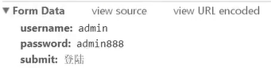

https://www.bilibili.com/video/BV1MU4y1u7SX?p=5&vd_source=82d188e70a66018d5a366d01b4858dc1

## 第一章:简介:

​	信息收集最为重要,占用时间最长


HTTP代理:截断数据传输(如Burpsuite )

爬虫:爬取网Web app:ZAP Burpsuite Httrack  Scrapy(python工具)

漏洞扫描(技术性漏洞):Appscan AWVS  W3af(python)

目录探测:对Web App不链接页面探测   Dirb,wfuzz


通过此文件[Get_status_code.py](Get_status_code.py) ,学习用`request.get()`请求网址得到状态码


## 第二章:HTTP与HTTPS协议:

#### 1.hppt的80端口

80端口一般用于服务端,客户端使用随机的非占用端口


#### 2.http1.0与http1.1

http1.0 一次访问只能使用一个连接,而http1.1 多次访问可以使用一个连接

然而http1.0与http1.1都是不安全的,因为传输过程无加密,**明文传输**


##### 请求方法

http1.0:

1. GET
2. POST
3. HEAD

http1.1:

1. OPTIONS
2. PUT(文件上传)
3. DELETE(文件删除)
4. TRACE
5. CONNECT
6. PATCH


#### 3.hppts

hppts加密数据传输,服务端口默认为443


### URL

URL:`协议://主机名.域名/文件夹/文件?参数=值&amp;参数1=值1`


### HTTP请求头:

User-Agent:用户请求,携带浏览器版本信息
Accept encoding:浏览器接受的编码
Referer:网页来源(从哪里跳转过来)
Cookie:Cookie信息
Location:跳转到哪里(目标)
Set-Cookie:**HTTP响应头**,服务端和客户端设置的cookie信息
WW-Authenticate:HTTP认证信息(如HTTP Basic等)


### HTTP相应状态码:

1xx:信息提示
2xx:请求成功
3xx:重定向
4xx:客户端错误(如404,访问了不存在的页面)
5xx:服务端错误


## 分析网页审查元素:


如图.访问百度并进行审查(F12)

这个文件是对图片的请求,有**Request URL:**和Request Method: GET  (请求方法)

Remote Address: [2409:8c54:1831:ff00::78e9:4b21]:443  请求的ip地址和端口号


其他响应头


Burpsuite HTTP 截断代理等工具也可以用于审查,甚至可以修改请求内容,删除响应中的请求内容使其不出现在浏览器中


### 第二节python-HTTP请求

#### GET请求: [GET.py](GET.py)  [Get_status_code.py](Get_status_code.py) (带参数的实验)


如图,校园网登录使用的是get请求,所以用 [Get_status_code.py](Get_status_code.py)可以直接登录

`requests.get(url=url,[params=key1=val1,key2=val2])`,

`print(r.url)`输出r的url

`print(r0.status_code)`输出r的状态码 

`print(r.text)`  输出响应的文本

`print(r.content)`输出响应的二进制编码


#### POST请求:  [POST.py](PYTHON文件\POST.py) (带参数的实验)


如图,登录使用post请求


通过from data找到提交的参数

`requests.post(url=url,[params=key1=val1,key2=val2])`

基本用法与GET一致


#### 自定义请求头 [define_headers.py](PYTHON文件\define_headers.py) 

```
header={key1:val1}

request.get(url,headers=header)
```

通过`headers`参数指定

`print(r1.request.headers)`查看请求头


如图,默认请求头为`'python-requests/2.25.1'`,设置过后为`'HAHA'`


#### 其他请求

```
r = requests.put('http://httpbin.org/put',data=
{'key":'value'})
r = requests.delete('http://httpbin.org/delete)
r = requests.head(http://http//in.org/get')
r = requests.options('http://httpbin.org/get')
```

request有大多数http基本请求


https://www.bilibili.com/video/BV1MU4y1u7SX?p=6&spm_id_from=pageDriver&vd_source=82d188e70a66018d5a366d01b4858dc1